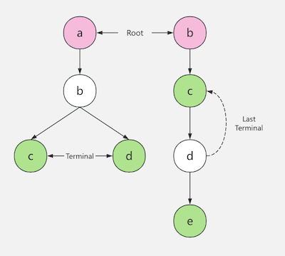

# go-masking

<div>
 
 
 
 
</div>

[中文](README_CN.md)

Ultrafast log masking library. It can find the data that needs to be
masked from the log and then mask them.

### Usage

```
import "github.com/lvan100/go-masking"

// Merges rules. You can customize your own masker function.
err := masking.MergeRules(map[string]*masking.Rule{
    "phone": {
        Desc: "手机号",
        Keys: []string{
            "cell", "driver_phone", "spec-cell",
            "p_prefix_other_*",
        },
        Length: 30,
        Masker: masking.SimplePhoneMasker,
    },
})
		
// Masks the byte slice in-place. If masking duration exceeds 
// 2000 microseconds, the desensitization will be interrupted.
_, intercepted := masking.Mask(src, 2000)
```

### Design

The library constructs a trie tree from the rules. And the trie tree is
used to find the longest match. If a match is found, it will be recorded,
then the masking function will be applied. Assuming we have a trie tree:



If we have a log like this:

```
abc:1234567890, tbc:1234567890
```

- First, the trie tree will find the longest match key: `abc` and `bc`.

- Second, the library checks if the matched key is valid, which has start
  splitter and end splitter, so `abc` is valid and `bc` is not.

- Last, the library will try to mask a fixed length string after the key.