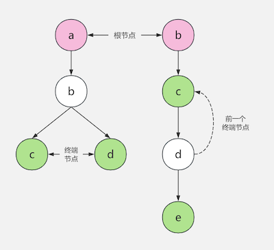

# go-masking

[英文](README.md)

超级快的日志脱敏库。它可以从日志中寻找到需要脱敏的数据，然后脱敏之。

### 使用方法

```
import "github.com/lvan100/go-masking"

// Merges rules. You can customize your own masker function.
err := masking.MergeRules(map[string]*masking.Rule{
    "phone": {
        Desc: "手机号",
        Keys: []string{
            "cell", "driver_phone", "spec-cell",
            "p_prefix_other_*",
        },
        Length: 30,
        Masker: masking.SimplePhoneMasker,
    },
})
		
// Masks the byte slice in-place. If masking duration exceeds 
// 2000 microseconds, the desensitization will be interrupted.
_, intercepted := masking.Mask(src, 2000)
```

### 运行原理

该库首先根据规则的 key 构建出一棵前缀树 (trie tree)，然后使用这棵前缀树去匹配 key。
如果成功匹配到了 key，则将它记录下来，然后进行数据脱敏。假设我们有这样一棵前缀树：




然后我们有这样一段日志:

```
abc:1234567890, tbc:1234567890
```

- 首先，根据前面的前缀树，可以找到 `abc` 和 `bc` 两个最长匹配的 key。

- 然后，该库会检查找到的 key 是否有效，即 key 必须有开始和结束分隔符。
  本例中，`abc` 是有效的，而 `bc` 则是无效的 (数字不是有效的分隔符)。

- 最后，该库会尝试对 key 后面固定长度的字符串进行脱敏处理。